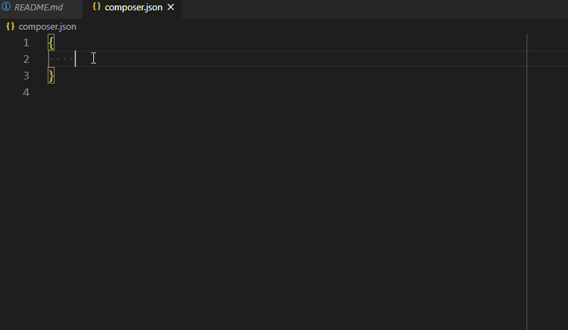

# Composer - Snippets for composer.json

This little utility will help you when writing and maintaining your composer.json file.

## How to use

Once installed, open your `composer.json` file and start to type one of the snippets like `authors` or `autoload` on a new line.

A list of snippets will be displayed; press <kbd>ENTER</kbd> to validate your choice.

## Installation guide

1. Make a clone of this repository in f.i. folder `c:\repo\composer-addon-vscode-1.0.0`
2. Start a DOS Command Prompt **with admin rights** and go to your vscode extensions folder i.e. run `cd %USERPROFILE%\.vscode\extensions`
3. Create a symlink to the cloned repo i.e. run `mklink /D composer-addon-vscode-1.0.0 c:\repo\composer-addon-vscode-1.0.0`
4. Start (or reload) VS Code

In order to verify if the extension is correctly installed, open your extensions panel (press <kbd>CTRL</kbd>-<kbd>SHIFT</kbd>-<kbd>X</kbd>) and type `@installed` to get the list of installed extensions. You should see `Composer - Snippets for composer.json` in the list.

Make sure the extension is installed by clicking on it and verify his status.

## List of snippets

* `autoload`: Insert an autoload/psr-4 block in the file
* `authors`: Insert an authors block in the file

## License

[MIT](LICENSE)
